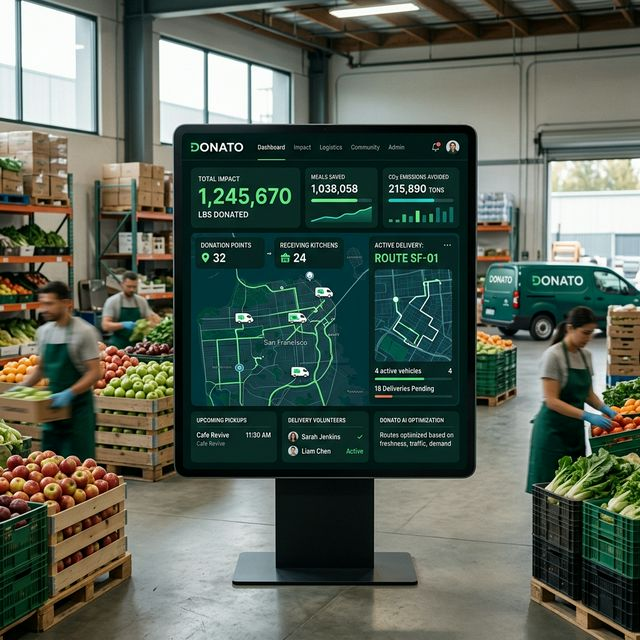

<p align="center">
  
</p>

<h1 align="center">🍎 Donato</h1>

<p align="center">
  <strong>The Future of Food Redistribution</strong>
</p>

<p align="center">
  
  
  
</p>

---

## 🌟 Overview

**Donato** is a state-of-the-art, AI-powered platform designed to tackle food waste and hunger effectively. By connecting donors, NGOs, and farms into a seamless network, Donato ensures that surplus food reaches those who need it most or is sustainably composted.

### Why Donato? 🤔
- **🚀 Efficiency**: Real-time matching of donations to NGOs.
- **🧠 Intelligence**: AI-fied freshness detection using computer vision.
- **🌱 Sustainability**: Zero-waste goal through farm-composting integrations.
- **🤝 Community**: Building a localized support network.

---

## ✨ Key Features

| Feature | Description |
| :--- | :--- |
| **🤖 AI Freshness Detection** | Automatically assess food quality using ML models to ensure safety. |
| **📍 Smart Logistics** | Real-time tracking and routing for distribution to local NGOs. |
| **🚜 Farm Integration** | Automatic redirect of non-edible food to farms for composting. |
| **📊 Analytics Dashboard** | Comprehensive insights into donation impact and redistribution metrics. |
| **🔐 Secure Handoffs** | OTP-based verification for every food transfer to ensure accountability. |

---

## 🛠️ Technology Stack

<p align="center">
  
  
  
  
  
  
</p>

---

## 🚀 Getting Started

### Prerequisites

- [Node.js](https://nodejs.org/) (v16+)
- [Python 3.10+](https://www.python.org/)

### Local Development

1. **Clone the repository**
   ```bash
   git clone https://github.com/NitheshT07/Donato.git
   cd Donato
   ```

2. **Setup Frontend**
   ```bash
   cd frontend
   npm install
   npm run dev
   ```

3. **Setup Backend**
   ```bash
   cd ../backend
   pip install -r requirements.txt
   python main.py
   ```

---

## 🤝 Contributing

We welcome contributions! Whether it's fixing bugs, improving documentation, or suggesting new features, your help is appreciated. 

1. Fork the Project.
2. Create your Feature Branch (`git checkout -b feature/AmazingFeature`).
3. Commit your Changes (`git commit -m 'Add some AmazingFeature'`).
4. Push to the Branch (`git push origin feature/AmazingFeature`).
5. Open a Pull Request.

---

<p align="center">
  Made with ❤️ for a better world.
</p>
